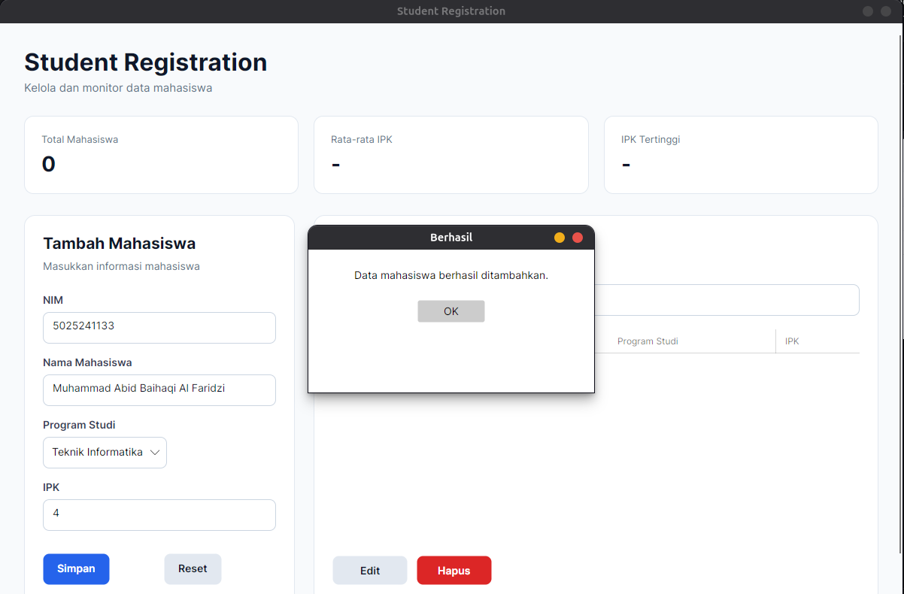
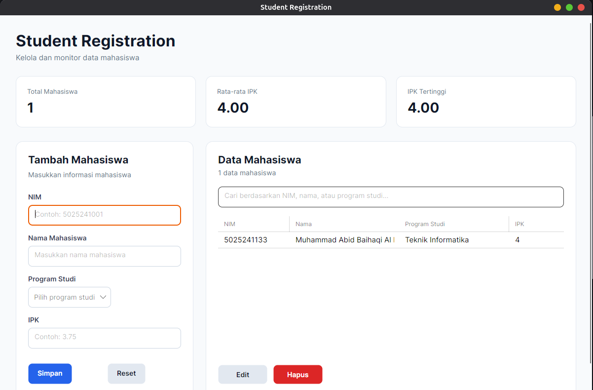
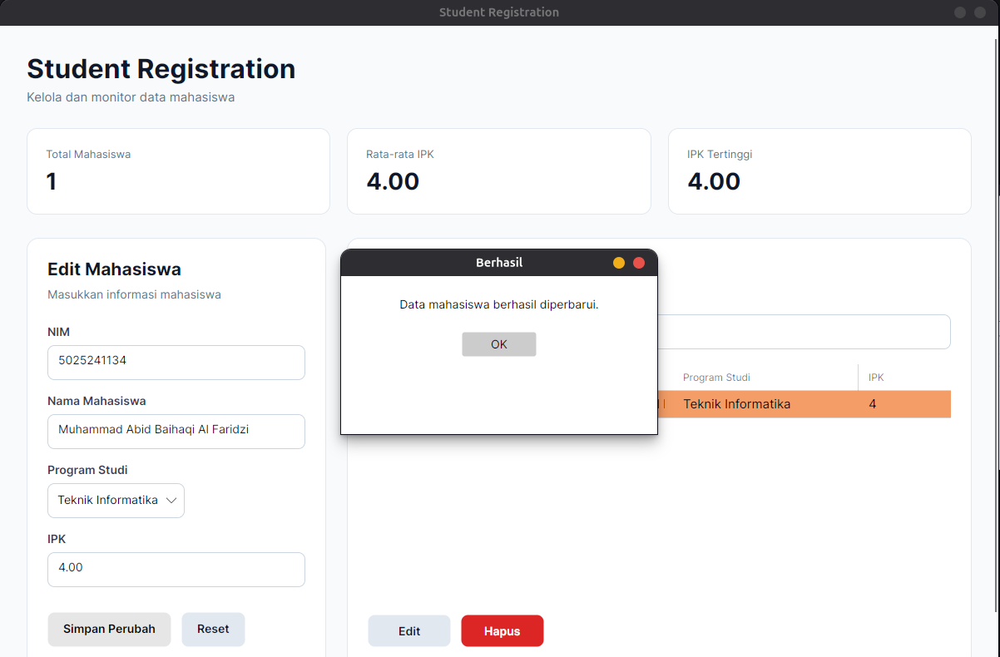

# Implementasi .NET Framework & C# untuk Pembuatan Aplikasi WPF (Student Registration Dashboard)

Nama: Muhammad Abid Baihaqi Al Faridzi

NRP: 5025241133

Prodi: Teknik Informatika

Mata Kuliah: Pemrograman Berbasis Kerangka Kerja

Kelas: D


---

## Program Student Registration Desktop Dashboard

Program ini merupakan aplikasi berbasis **Desktop GUI** yang dibangun menggunakan bahasa pemrograman **C#**, platform **.NET 10**, dan framework **Avalonia UI**. Avalonia digunakan agar aplikasi desktop dapat dikembangkan dan dijalankan secara cross-platform, termasuk pada sistem operasi Ubuntu.

Aplikasi dirancang sebagai dashboard pengelolaan data mahasiswa dengan antarmuka grafis modern. Data mahasiswa yang dikelola terdiri dari **NIM, Nama, Program Studi, dan IPK**.

Program memiliki beberapa fitur utama, yaitu:

- Menambahkan data mahasiswa.
- Menampilkan data mahasiswa pada `DataGrid`.
- Mengedit data mahasiswa.
- Menghapus data mahasiswa dengan dialog konfirmasi.
- Melakukan pencarian mahasiswa berdasarkan NIM, nama, atau program studi.
- Validasi input NIM, nama, program studi, dan IPK.
- Validasi NIM agar tidak terjadi duplikasi data.
- Dashboard statistik untuk menampilkan total mahasiswa, rata-rata IPK, dan IPK tertinggi.
- Custom UI Styling menggunakan AXAML.
- Tampilan light theme agar konsisten pada Ubuntu.

---

## Setup Project Directory

```bash
dotnet new avalonia.app -o StudentRegistrationApp
cd StudentRegistrationApp
```

Perintah tersebut digunakan untuk membuat project Avalonia baru dengan nama `StudentRegistrationApp`, kemudian berpindah ke direktori project.

Untuk menggunakan `DataGrid`, tambahkan package:

```bash
dotnet add package Avalonia.Controls.DataGrid --version 12.1.2
```

Project kemudian memiliki struktur:

```text
StudentRegistrationApp/
├── App.axaml
├── App.axaml.cs
├── MainWindow.axaml
├── MainWindow.axaml.cs
├── Program.cs
└── StudentRegistrationApp.csproj
```

---

## Konfigurasi File `StudentRegistrationApp.csproj`

```xml
<Project Sdk="Microsoft.NET.Sdk">
  <PropertyGroup>
    <OutputType>WinExe</OutputType>
    <TargetFramework>net10.0</TargetFramework>
    <Nullable>enable</Nullable>
    <ApplicationManifest>app.manifest</ApplicationManifest>
  </PropertyGroup>

  <ItemGroup>
    <PackageReference Include="Avalonia" Version="12.1.2" />
    <PackageReference Include="Avalonia.Controls.DataGrid" Version="12.1.2" />
    <PackageReference Include="Avalonia.Desktop" Version="12.1.2" />
    <PackageReference Include="Avalonia.Themes.Fluent" Version="12.1.2" />
    <PackageReference Include="Avalonia.Fonts.Inter" Version="12.1.2" />
    <PackageReference Include="AvaloniaUI.DiagnosticsSupport" Version="2.2.3">
      <IncludeAssets Condition="'$(Configuration)' != 'Debug'">None</IncludeAssets>
      <PrivateAssets Condition="'$(Configuration)' != 'Debug'">All</PrivateAssets>
    </PackageReference>
  </ItemGroup>
</Project>
```

File `.csproj` berfungsi sebagai konfigurasi utama project. `TargetFramework` menggunakan `net10.0`, sedangkan package Avalonia versi `12.1.2` digunakan untuk membangun aplikasi desktop cross-platform.

Package `Avalonia.Controls.DataGrid` ditambahkan karena kontrol `DataGrid` berada pada package terpisah. `Avalonia.Desktop` menyediakan runtime desktop, `Avalonia.Themes.Fluent` menyediakan Fluent Theme, dan `Avalonia.Fonts.Inter` digunakan untuk font bawaan aplikasi.

---

## Edit File `Program.cs`

```csharp
using Avalonia;
using System;

namespace StudentRegistrationApp;

class Program
{
    // Initialization code. Don't use any Avalonia, third-party APIs or any
    // SynchronizationContext-reliant code before AppMain is called: things aren't initialized
    // yet and stuff might break.
    [STAThread]
    public static void Main(string[] args) => BuildAvaloniaApp()
        .StartWithClassicDesktopLifetime(args);

    // Avalonia configuration, don't remove; also used by visual designer.
    public static AppBuilder BuildAvaloniaApp()
        => AppBuilder.Configure<App>()
            .UsePlatformDetect()
#if DEBUG
            .WithDeveloperTools()
#endif
            .WithInterFont()
            .LogToTrace();
}
```

File `Program.cs` merupakan **entry point** aplikasi. Atribut `[STAThread]` menandai thread utama aplikasi sebagai Single-Threaded Apartment.

Method `Main()` memanggil `BuildAvaloniaApp()` dan kemudian menjalankan aplikasi menggunakan `StartWithClassicDesktopLifetime(args)`.

`UsePlatformDetect()` digunakan agar Avalonia menyesuaikan backend dengan sistem operasi yang digunakan, sedangkan `WithDeveloperTools()` mengaktifkan developer tools ketika aplikasi berjalan dalam mode `DEBUG`.

---

## Edit File `App.axaml`

```xml
<Application
    xmlns="https://github.com/avaloniaui"
    xmlns:x="http://schemas.microsoft.com/winfx/2006/xaml"
    x:Class="StudentRegistrationApp.App"
    RequestedThemeVariant="Light">

    <Application.Styles>

        <FluentTheme />

        <StyleInclude
            Source="avares://Avalonia.Controls.DataGrid/Themes/Fluent.xaml" />

    </Application.Styles>

</Application>
```

File `App.axaml` digunakan untuk mengatur konfigurasi visual global aplikasi.

`RequestedThemeVariant="Light"` memaksa aplikasi menggunakan light theme agar warna komponen tetap konsisten walaupun Ubuntu menggunakan dark mode.

`FluentTheme` digunakan sebagai theme utama, sedangkan `StyleInclude` memuat style Fluent khusus untuk komponen `DataGrid`.

---

## Edit File `MainWindow.axaml`

```xml
<Window
    xmlns="https://github.com/avaloniaui"
    xmlns:x="http://schemas.microsoft.com/winfx/2006/xaml"

    x:Class="StudentRegistrationApp.MainWindow"

    x:CompileBindings="False"

    Title="Student Registration"

    Width="1200"
    Height="760"

    MinWidth="950"
    MinHeight="650"

    Background="#F8FAFC"

    WindowStartupLocation="CenterScreen">

    <Window.Styles>
        <Style Selector="TextBox.formInput">
            <Setter Property="Height" Value="42"/>
            <Setter Property="Padding" Value="12,8"/>
            <Setter Property="CornerRadius" Value="8"/>

            <Setter Property="Background" Value="#FFFFFF"/>
            <Setter Property="Foreground" Value="#0F172A"/>

            <Setter Property="BorderBrush" Value="#CBD5E1"/>
            <Setter Property="BorderThickness" Value="1"/>
        </Style>

        <Style Selector="TextBox.formInput:focus">
            <Setter Property="Background" Value="#FFFFFF"/>
            <Setter Property="Foreground" Value="#0F172A"/>
            <Setter Property="BorderBrush" Value="#2563EB"/>
            <Setter Property="BorderThickness" Value="2"/>
        </Style>

        <Style Selector="ComboBox.formInput">

            <Setter
                Property="Height"
                Value="42"/>

            <Setter
                Property="CornerRadius"
                Value="8"/>

            <Setter
                Property="Background"
                Value="#FFFFFF"/>

            <Setter
                Property="BorderBrush"
                Value="#CBD5E1"/>

            <Setter
                Property="BorderThickness"
                Value="1"/>

        </Style>

        <Style Selector="Button.primary">

            <Setter
                Property="Background"
                Value="#2563EB"/>

            <Setter
                Property="Foreground"
                Value="White"/>

            <Setter
                Property="CornerRadius"
                Value="8"/>

            <Setter
                Property="Padding"
                Value="18,10"/>

            <Setter
                Property="FontWeight"
                Value="SemiBold"/>

            <Setter
                Property="HorizontalContentAlignment"
                Value="Center"/>

        </Style>

        <Style Selector="Button.secondary">

            <Setter
                Property="Background"
                Value="#E2E8F0"/>

            <Setter
                Property="Foreground"
                Value="#0F172A"/>

            <Setter
                Property="CornerRadius"
                Value="8"/>

            <Setter
                Property="Padding"
                Value="18,10"/>

            <Setter
                Property="FontWeight"
                Value="SemiBold"/>

            <Setter
                Property="HorizontalContentAlignment"
                Value="Center"/>

        </Style>

        <Style Selector="Button.danger">

            <Setter
                Property="Background"
                Value="#DC2626"/>

            <Setter
                Property="Foreground"
                Value="White"/>

            <Setter
                Property="CornerRadius"
                Value="8"/>

            <Setter
                Property="Padding"
                Value="18,10"/>

            <Setter
                Property="FontWeight"
                Value="SemiBold"/>

            <Setter
                Property="HorizontalContentAlignment"
                Value="Center"/>

        </Style>

        <Style Selector="TextBlock.label">

            <Setter
                Property="Foreground"
                Value="#334155"/>

            <Setter
                Property="FontWeight"
                Value="SemiBold"/>

            <Setter
                Property="FontSize"
                Value="14"/>

        </Style>

        <Style Selector="TextBlock.cardLabel">

            <Setter
                Property="Foreground"
                Value="#64748B"/>

            <Setter
                Property="FontSize"
                Value="13"/>

        </Style>

        <Style Selector="TextBlock.cardValue">

            <Setter
                Property="Foreground"
                Value="#0F172A"/>

            <Setter
                Property="FontSize"
                Value="28"/>

            <Setter
                Property="FontWeight"
                Value="Bold"/>

        </Style>

    </Window.Styles>

    <ScrollViewer>

        <Grid
            Margin="32"

            RowDefinitions="
                Auto,
                Auto,
                *
            ">

            <StackPanel
                Grid.Row="0">

                <TextBlock
                    Text="Student Registration"
                    FontSize="32"
                    FontWeight="Bold"
                    Foreground="#0F172A"/>

                <TextBlock
                    Text="Kelola dan monitor data mahasiswa"
                    FontSize="15"
                    Foreground="#64748B"
                    Margin="0,5,0,0"/>

            </StackPanel>

            <Grid
                Grid.Row="1"

                Margin="0,28,0,28"

                ColumnDefinitions="
                    *,
                    20,
                    *,
                    20,
                    *
                ">

                <Border
                    Grid.Column="0"

                    Background="#FFFFFF"

                    BorderBrush="#E2E8F0"

                    BorderThickness="1"

                    CornerRadius="12"

                    Padding="22">

                    <StackPanel>

                        <TextBlock
                            Text="Total Mahasiswa"
                            Classes="cardLabel"/>

                        <TextBlock
                            x:Name="txtTotal"

                            Text="0"

                            Classes="cardValue"

                            Margin="0,8,0,0"/>

                    </StackPanel>

                </Border>

                <Border
                    Grid.Column="2"

                    Background="#FFFFFF"

                    BorderBrush="#E2E8F0"

                    BorderThickness="1"

                    CornerRadius="12"

                    Padding="22">

                    <StackPanel>

                        <TextBlock
                            Text="Rata-rata IPK"
                            Classes="cardLabel"/>

                        <TextBlock
                            x:Name="txtRataRata"

                            Text="-"

                            Classes="cardValue"

                            Margin="0,8,0,0"/>

                    </StackPanel>

                </Border>

                <Border
                    Grid.Column="4"

                    Background="#FFFFFF"

                    BorderBrush="#E2E8F0"

                    BorderThickness="1"

                    CornerRadius="12"

                    Padding="22">

                    <StackPanel>

                        <TextBlock
                            Text="IPK Tertinggi"
                            Classes="cardLabel"/>

                        <TextBlock
                            x:Name="txtIPKTertinggi"

                            Text="-"

                            Classes="cardValue"

                            Margin="0,8,0,0"/>

                    </StackPanel>

                </Border>

            </Grid>

            <Grid
                Grid.Row="2"

                ColumnDefinitions="
                    360,
                    25,
                    *
                ">

                <Border
                    Grid.Column="0"

                    Background="#FFFFFF"

                    BorderBrush="#E2E8F0"

                    BorderThickness="1"

                    CornerRadius="14"

                    Padding="24">

                    <StackPanel
                        Spacing="8">

                        <TextBlock
                            x:Name="txtFormTitle"

                            Text="Tambah Mahasiswa"

                            FontSize="21"

                            FontWeight="Bold"

                            Foreground="#0F172A"/>


                        <TextBlock
                            Text="Masukkan informasi mahasiswa"

                            Foreground="#64748B"

                            Margin="0,0,0,20"/>

                        <TextBlock
                            Text="NIM"

                            Classes="label"/>


                        <TextBox
                            x:Name="txtNim"

                            Classes="formInput"

                            PlaceholderText="Contoh: 5025241001"/>

                        <TextBlock
                            Text="Nama Mahasiswa"

                            Classes="label"

                            Margin="0,8,0,0"/>


                        <TextBox
                            x:Name="txtNama"

                            Classes="formInput"

                            PlaceholderText="Masukkan nama mahasiswa"/>

                        <TextBlock
                            Text="Program Studi"

                            Classes="label"

                            Margin="0,8,0,0"/>


                        <ComboBox
                            x:Name="cmbProdi"

                            Classes="formInput"

                            PlaceholderText="Pilih program studi">


                            <ComboBoxItem
                                Content="Teknik Informatika"/>

                            <ComboBoxItem
                                Content="Sistem Informasi"/>

                            <ComboBoxItem
                                Content="Teknik Komputer"/>

                            <ComboBoxItem
                                Content="Teknologi Informasi"/>

                            <ComboBoxItem
                                Content="Sains Data"/>


                        </ComboBox>

                        <TextBlock
                            Text="IPK"

                            Classes="label"

                            Margin="0,8,0,0"/>


                        <TextBox
                            x:Name="txtIPK"

                            Classes="formInput"

                            PlaceholderText="Contoh: 3.75"/>

                        <Grid
                            Margin="0,22,0,0"

                            ColumnDefinitions="
                                *,
                                12,
                                *
                            ">


                            <Button
                                Grid.Column="0"

                                x:Name="btnSimpan"

                                Content="Simpan"

                                Classes="primary"

                                Height="42"

                                Click="BtnSimpan_Click"/>


                            <Button
                                Grid.Column="2"

                                Content="Reset"

                                Classes="secondary"

                                Height="42"

                                Click="BtnReset_Click"/>

                        </Grid>


                    </StackPanel>

                </Border>

                <Border
                    Grid.Column="2"

                    Background="#FFFFFF"

                    BorderBrush="#E2E8F0"

                    BorderThickness="1"

                    CornerRadius="14"

                    Padding="24">


                    <Grid
                        RowDefinitions="
                            Auto,
                            Auto,
                            *,
                            Auto
                        ">

                        <Grid
                            Grid.Row="0"

                            ColumnDefinitions="
                                *,
                                Auto
                            ">


                            <StackPanel>

                                <TextBlock
                                    Text="Data Mahasiswa"

                                    FontSize="21"

                                    FontWeight="Bold"

                                    Foreground="#0F172A"/>


                                <TextBlock
                                    x:Name="txtJumlahData"

                                    Text="0 data mahasiswa"

                                    Foreground="#64748B"

                                    Margin="0,4,0,0"/>

                            </StackPanel>

                        </Grid>

                        <TextBox
                            Grid.Row="1"

                            x:Name="txtSearch"

                            Classes="formInput"

                            PlaceholderText="Cari berdasarkan NIM, nama, atau program studi..."

                            Margin="0,20,0,18"

                            TextChanged="TxtSearch_TextChanged"/>

                        <DataGrid
                            Grid.Row="2"

                            x:Name="dgMahasiswa"

                            AutoGenerateColumns="False"

                            IsReadOnly="True"

                            GridLinesVisibility="Horizontal"

                            BorderThickness="0"

                            SelectionMode="Single">


                            <DataGrid.Columns>


                                <DataGridTextColumn
                                    Header="NIM"

                                    Binding="{Binding NIM}"

                                    Width="1.3*"/>


                                <DataGridTextColumn
                                    Header="Nama"

                                    Binding="{Binding Nama}"

                                    Width="2*"/>


                                <DataGridTextColumn
                                    Header="Program Studi"

                                    Binding="{Binding Prodi}"

                                    Width="2*"/>


                                <DataGridTextColumn
                                    Header="IPK"

                                    Binding="{Binding IPK}"

                                    Width="*"/>


                            </DataGrid.Columns>

                        </DataGrid>

                        <Grid
                            Grid.Row="3"

                            Margin="0,20,0,0"

                            ColumnDefinitions="
                                Auto,
                                12,
                                Auto,
                                *
                            ">


                            <Button
                                Grid.Column="0"

                                Content="Edit"

                                Classes="secondary"

                                Width="100"

                                Click="BtnEdit_Click"/>


                            <Button
                                Grid.Column="2"

                                Content="Hapus"

                                Classes="danger"

                                Width="100"

                                Click="BtnHapus_Click"/>


                        </Grid>


                    </Grid>

                </Border>

            </Grid>

        </Grid>

    </ScrollViewer>

</Window>
```

File `MainWindow.axaml` digunakan untuk membangun keseluruhan antarmuka aplikasi.

Bagian `Window.Styles` mendefinisikan custom styling untuk komponen seperti:

- `TextBox.formInput`
- `ComboBox.formInput`
- `Button.primary`
- `Button.secondary`
- `Button.danger`
- `TextBlock.label`
- `TextBlock.cardLabel`
- `TextBlock.cardValue`

Dashboard utama terdiri dari tiga card statistik, yaitu **Total Mahasiswa**, **Rata-rata IPK**, dan **IPK Tertinggi**.

Form di sisi kiri digunakan untuk memasukkan data mahasiswa, sedangkan sisi kanan menampilkan data menggunakan `DataGrid`. Search box di atas `DataGrid` digunakan untuk melakukan pencarian secara real-time.

`x:CompileBindings="False"` digunakan agar binding seperti `{Binding NIM}`, `{Binding Nama}`, `{Binding Prodi}`, dan `{Binding IPK}` dapat digunakan tanpa mendefinisikan `x:DataType` secara eksplisit.

---

## Edit File `MainWindow.axaml.cs`

```csharp
using Avalonia;
using Avalonia.Controls;
using Avalonia.Interactivity;

using System;
using System.Collections.Generic;
using System.Globalization;
using System.Linq;
using System.Threading.Tasks;

namespace StudentRegistrationApp
{
    public partial class MainWindow : Window
    {
        private readonly List<Mahasiswa> daftarMahasiswa = new();
        private Mahasiswa? mahasiswaSedangDiedit = null;

        public MainWindow(){
            InitializeComponent();
            RefreshData();
            UpdateDashboard();
        }

        public class Mahasiswa{
            public string NIM{
                get;
                set;
            }

            public string Nama{
                get;
                set;
            }

            public string Prodi{
                get;
                set;
            }

            public double IPK{
                get;
                set;
            }

            public Mahasiswa(
                string nim,
                string nama,
                string prodi,
                double ipk
            ){
                NIM = nim;
                Nama = nama;
                Prodi = prodi;
                IPK = ipk;
            }
        }

        private async void BtnSimpan_Click(object? sender, RoutedEventArgs e){
            string nim = txtNim.Text?.Trim() ?? "";
            string nama = txtNama.Text?.Trim() ?? "";

            if (string.IsNullOrWhiteSpace(nim)){
                await TampilkanPesan("Validasi", "NIM harus diisi.");
                txtNim.Focus();
                return;
            }

            if (string.IsNullOrWhiteSpace(nama)){
                await TampilkanPesan("Validasi", "Nama mahasiswa harus diisi.");
                txtNama.Focus();
                return;
            }

            if (cmbProdi.SelectedItem is not ComboBoxItem selectedProdi){
                await TampilkanPesan("Validasi", "Program studi harus dipilih.");
                return;
            }

            string prodi = selectedProdi.Content?.ToString() ?? "";

            if (!CobaParseIPK(txtIPK.Text, out double ipk)){
                await TampilkanPesan("Validasi", "IPK harus berupa angka.");
                txtIPK.Focus();
                return;
            }

            if (ipk < 0 || ipk > 4){
                await TampilkanPesan("Validasi", "IPK harus berada antara 0 sampai 4.");
                txtIPK.Focus();
                return;
            }

            if (mahasiswaSedangDiedit == null){
                bool nimSudahAda = daftarMahasiswa.Any(m => m.NIM.Equals(nim, StringComparison.OrdinalIgnoreCase));

                if (nimSudahAda){
                    await TampilkanPesan("Validasi", "NIM tersebut sudah terdaftar.");
                    txtNim.Focus();
                    return;
                }

                Mahasiswa mahasiswaBaru = new Mahasiswa(nim, nama, prodi, ipk);

                daftarMahasiswa.Add(mahasiswaBaru);

                await TampilkanPesan("Berhasil","Data mahasiswa berhasil ditambahkan.");
            }
            else{
                bool nimDipakaiMahasiswaLain = daftarMahasiswa.Any(
                    m =>
                        m != mahasiswaSedangDiedit
                        &&
                        m.NIM.Equals(
                            nim,
                            StringComparison.OrdinalIgnoreCase
                        )
                );

                if (nimDipakaiMahasiswaLain){
                    await TampilkanPesan("Validasi","NIM sudah digunakan mahasiswa lain.");
                    txtNim.Focus();
                    return;

                }

                mahasiswaSedangDiedit.NIM = nim;
                mahasiswaSedangDiedit.Nama = nama;
                mahasiswaSedangDiedit.Prodi = prodi;
                mahasiswaSedangDiedit.IPK = ipk;

                await TampilkanPesan("Berhasil", "Data mahasiswa berhasil diperbarui.");
            }

            RefreshData();
            UpdateDashboard();
            ResetForm();
        }

        private async void BtnEdit_Click(object? sender, RoutedEventArgs e){
            if (dgMahasiswa.SelectedItem is not Mahasiswa mahasiswa){
                await TampilkanPesan("Informasi","Pilih mahasiswa yang ingin diedit.");
                return;
            }

            mahasiswaSedangDiedit = mahasiswa;

            txtNim.Text = mahasiswa.NIM;
            txtNama.Text = mahasiswa.Nama;
            txtIPK.Text = mahasiswa.IPK.ToString("0.00", CultureInfo.InvariantCulture);

            foreach (object? item in cmbProdi.Items){
                if (item is ComboBoxItem comboItem && comboItem.Content?.ToString() == mahasiswa.Prodi
                ){
                    cmbProdi.SelectedItem = comboItem;
                    break;
                }
            }

            txtFormTitle.Text = "Edit Mahasiswa";
            btnSimpan.Content = "Simpan Perubahan";

            txtNim.Focus();
        }

        private async void BtnHapus_Click(object? sender, RoutedEventArgs e){
            if (dgMahasiswa.SelectedItem is not Mahasiswa mahasiswa){
                await TampilkanPesan("Informasi", "Pilih mahasiswa yang ingin dihapus.");
                return;

            }

            bool konfirmasi = await TampilkanKonfirmasi("Konfirmasi Hapus", $"Apakah yakin ingin menghapus data {mahasiswa.Nama}?");

            if (!konfirmasi){
                return;
            }

            daftarMahasiswa.Remove(mahasiswa);

            if (mahasiswaSedangDiedit == mahasiswa){
                ResetForm();
            }

            RefreshData();
            UpdateDashboard();

            await TampilkanPesan("Berhasil", "Data mahasiswa berhasil dihapus.");
        }

        private void BtnReset_Click(object? sender, RoutedEventArgs e){
            ResetForm();
        }

        private void ResetForm(){
            txtNim.Clear();
            txtNama.Clear();
            txtIPK.Clear();

            cmbProdi.SelectedIndex = -1;

            mahasiswaSedangDiedit = null;

            txtFormTitle.Text = "Tambah Mahasiswa";
            btnSimpan.Content = "Simpan";

            txtNim.Focus();
        }

        private void TxtSearch_TextChanged(object? sender, TextChangedEventArgs e){
            RefreshData();
        }

        private void RefreshData(){
            string keyword = txtSearch.Text?.Trim().ToLowerInvariant()?? "";

            List<Mahasiswa> hasil;

            if (string.IsNullOrWhiteSpace(keyword)){
                hasil = daftarMahasiswa.ToList();
            }
            else{
                hasil = daftarMahasiswa
                    .Where(
                        m =>
                            m.NIM
                                .ToLowerInvariant()
                                .Contains(keyword)
                            ||
                            m.Nama
                                .ToLowerInvariant()
                                .Contains(keyword)
                            ||
                            m.Prodi
                                .ToLowerInvariant()
                                .Contains(keyword)
                    ).ToList();
            }

            dgMahasiswa.ItemsSource = hasil;
            txtJumlahData.Text = $"{hasil.Count} data mahasiswa";
        }

        private void UpdateDashboard(){
            int total = daftarMahasiswa.Count;

            txtTotal.Text = total.ToString();

            if (total == 0){
                txtRataRata.Text = "-";
                txtIPKTertinggi.Text = "-";
                return;
            }

            double rataRata = daftarMahasiswa.Average(m => m.IPK);
            double tertinggi = daftarMahasiswa.Max(m => m.IPK);

            txtRataRata.Text = rataRata.ToString("0.00");
            txtIPKTertinggi.Text = tertinggi.ToString("0.00");
        }

        private bool CobaParseIPK(string? input, out double ipk){
            ipk = 0;

            if (string.IsNullOrWhiteSpace(input)){
                return false;
            }

            if (double.TryParse(input, NumberStyles.Float, CultureInfo.CurrentCulture, out ipk)){
                return true;
            }

            if (double.TryParse(input, NumberStyles.Float, CultureInfo.InvariantCulture, out ipk)){
                return true;
            }

            string alternatif = input.Replace(',', '.');

            return double.TryParse(alternatif, NumberStyles.Float, CultureInfo.InvariantCulture, out ipk);
        }

        private async Task TampilkanPesan(string judul, string pesan){
            Window dialog = new Window{
                Title = judul,
                Width = 380,
                Height = 190,
                CanResize = false,
                WindowStartupLocation = WindowStartupLocation.CenterOwner
            };

            TextBlock isiPesan = new TextBlock{
                Text = pesan,
                TextWrapping = Avalonia.Media.TextWrapping.Wrap,
                HorizontalAlignment = Avalonia.Layout.HorizontalAlignment.Center,
                TextAlignment = Avalonia.Media.TextAlignment.Center
            };

            Button btnOK = new Button{
                Content = "OK",
                Width = 90,
                HorizontalAlignment = Avalonia.Layout.HorizontalAlignment.Center,
                HorizontalContentAlignment = Avalonia.Layout.HorizontalAlignment.Center
            };

            btnOK.Click += (_, _) =>{
                dialog.Close();
            };

            StackPanel panel = new StackPanel{
                Margin = new Thickness(25),
                Spacing = 25
            };

            panel.Children.Add(isiPesan);
            panel.Children.Add(btnOK);

            dialog.Content = panel;

            await dialog.ShowDialog(this);
        }

        private async Task<bool> TampilkanKonfirmasi(string judul,string pesan){
            bool hasil = false;

            Window dialog = new Window{
                Title = judul,
                Width = 400,
                Height = 210,
                CanResize = false,
                WindowStartupLocation = WindowStartupLocation.CenterOwner
            };

            TextBlock isiPesan = new TextBlock{
                Text = pesan,
                TextWrapping = Avalonia.Media.TextWrapping.Wrap,
                TextAlignment = Avalonia.Media.TextAlignment.Center,
                HorizontalAlignment = Avalonia.Layout.HorizontalAlignment.Center
            };

            Button btnBatal = new Button{
                Content = "Batal",
                Width = 100
            };

            Button btnHapus = new Button{
                Content = "Hapus",
                Width = 100,
                Background = Avalonia.Media.Brushes.Crimson,
                Foreground = Avalonia.Media.Brushes.White
            };

            btnBatal.Click += (_, _) =>{
                hasil = false;
                dialog.Close();
            };

            btnHapus.Click += (_, _) =>{
                hasil = true;
                dialog.Close();
            };

            StackPanel buttons = new StackPanel{
                Orientation = Avalonia.Layout.Orientation.Horizontal,
                HorizontalAlignment = Avalonia.Layout.HorizontalAlignment.Center,
                Spacing = 12
            };

            buttons.Children.Add(btnBatal);
            buttons.Children.Add(btnHapus);

            StackPanel panel = new StackPanel{
                Margin = new Thickness(25),
                Spacing = 30
            };

            panel.Children.Add(isiPesan);
            panel.Children.Add(buttons);

            dialog.Content = panel;

            await dialog.ShowDialog(this);

            return hasil;
        }
    }
}
```

File `MainWindow.axaml.cs` memuat seluruh logika utama aplikasi.

Class `Mahasiswa` digunakan sebagai model data dan memiliki property `NIM`, `Nama`, `Prodi`, dan `IPK`. Seluruh data disimpan sementara di dalam:

```csharp
private readonly List<Mahasiswa> daftarMahasiswa = new();
```

Method `BtnSimpan_Click()` menangani proses tambah dan update data. Sebelum data disimpan, program melakukan validasi untuk memastikan NIM dan nama tidak kosong, program studi telah dipilih, serta IPK berupa angka pada rentang 0 sampai 4.

Program juga menggunakan LINQ melalui `.Any()` untuk memastikan NIM tidak duplikat.

Method `BtnEdit_Click()` mengambil data dari baris `DataGrid` yang sedang dipilih dan memindahkannya kembali ke form. Setelah itu form berubah ke mode edit dan tombol `Simpan` menjadi `Simpan Perubahan`.

Method `BtnHapus_Click()` menghapus data mahasiswa setelah pengguna memberikan konfirmasi melalui dialog.

Method `RefreshData()` menangani refresh `DataGrid` sekaligus pencarian berdasarkan NIM, nama, atau program studi. Proses pencarian menggunakan LINQ `.Where()`.

Method `UpdateDashboard()` menghitung:

- total mahasiswa menggunakan `Count`,
- rata-rata IPK menggunakan `.Average()`,
- IPK tertinggi menggunakan `.Max()`.

Method `CobaParseIPK()` menangani parsing IPK menggunakan culture sistem dan invariant culture agar input seperti `3.75` maupun `3,75` tetap dapat diproses.

Method `TampilkanPesan()` dan `TampilkanKonfirmasi()` digunakan untuk membuat dialog informasi dan konfirmasi secara programatik menggunakan komponen Avalonia.

---

## How to Run (In Ubuntu)

Pastikan .NET sudah tersedia:

```bash
dotnet --version
```

Masuk ke direktori project:

```bash
cd StudentRegistrationApp
```

Restore seluruh dependency:

```bash
dotnet restore
```

`dotnet restore` digunakan untuk mengunduh dan menyiapkan seluruh dependency atau package NuGet yang dibutuhkan project.

Build project:

```bash
dotnet build
```

`dotnet build` digunakan untuk melakukan kompilasi source code dan memeriksa apakah terdapat error pada project.

Jalankan aplikasi:

```bash
dotnet run
```

`dotnet run` digunakan untuk menjalankan aplikasi dan secara otomatis melakukan build terlebih dahulu apabila diperlukan.


---

## Program Documentation

### 1. Dashboard Statistik


### 2. Tambah Mahasiswa






### 3. Edit Mahasiswa





### 5. Hapus Mahasiswa


### 6. Final


