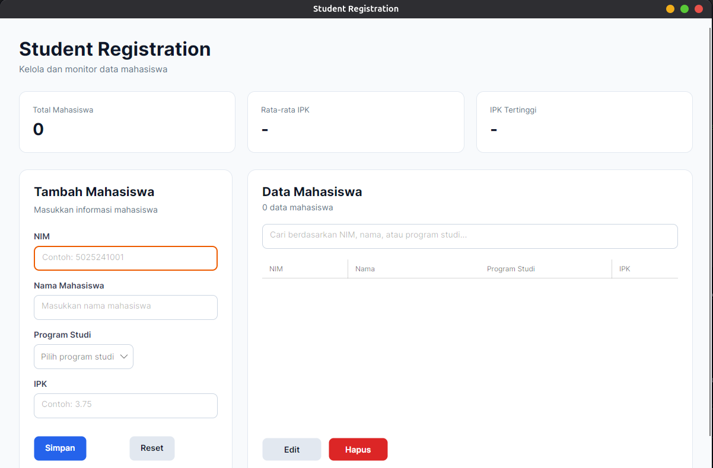
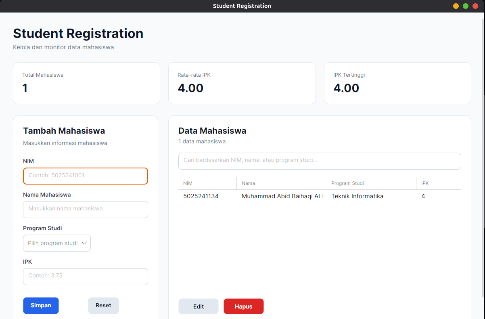
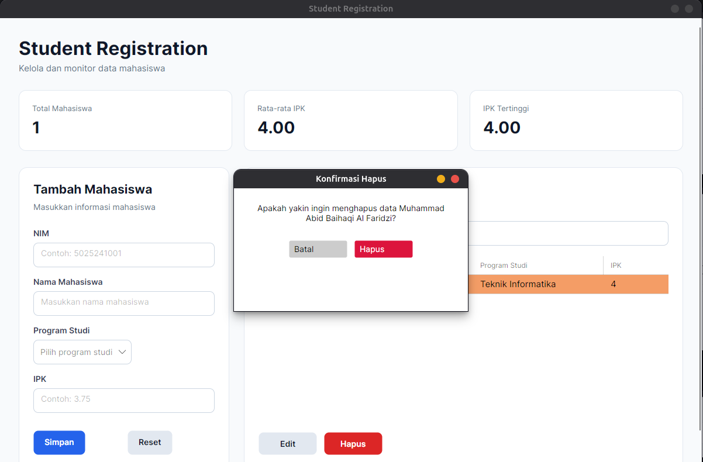
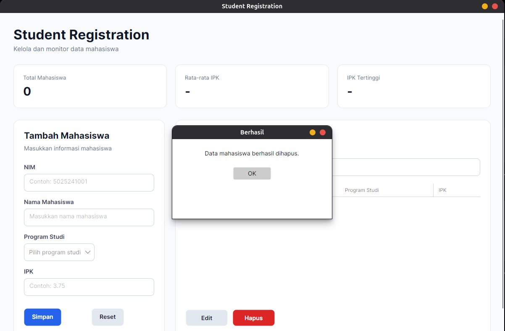

# Implementasi .NET Framework & C# untuk Pembuatan Aplikasi WPF (Student Registration Dashboard) dengan MVVM + Data Binding + Repository + SQLite

Nama: Muhammad Abid Baihaqi Al Faridzi

NRP: 5025241133

Prodi: Teknik Informatika

Mata Kuliah: Pemrograman Berbasis Kerangka Kerja

Kelas: D

---

## Program Student Registration Desktop Dashboard

Program ini merupakan aplikasi berbasis **Desktop GUI** yang dibangun menggunakan bahasa pemrograman **C#**, platform **.NET 10**, dan framework **Avalonia UI**. Project ini merupakan pengembangan dari Student Registration Dashboard sebelumnya dengan menambahkan pola arsitektur **MVVM (Model-View-ViewModel)**, **Data Binding**, **Command**, **Repository Pattern**, **Entity Framework Core**, dan **SQLite**.

Aplikasi digunakan untuk mengelola data mahasiswa berupa **NIM, Nama, Program Studi, dan IPK**. Berbeda dengan project sebelumnya yang masih menyimpan data di memory, versi ini menyimpan data secara persisten di database SQLite.

Program memiliki beberapa fitur utama, yaitu:

- Menambahkan data mahasiswa.
- Menampilkan data mahasiswa pada `DataGrid`.
- Mengedit data mahasiswa.
- Menghapus data mahasiswa.
- Melakukan pencarian berdasarkan NIM, nama, atau program studi.
- Validasi input NIM, nama, program studi, dan IPK.
- Validasi NIM agar tidak terjadi duplikasi.
- Dashboard statistik berupa total mahasiswa, rata-rata IPK, dan IPK tertinggi.
- Implementasi MVVM dan Data Binding.
- Implementasi Command menggunakan `CommunityToolkit.Mvvm`.
- Implementasi Repository Pattern.
- Penyimpanan data persisten menggunakan SQLite.
- Integrasi Entity Framework Core.
- Custom UI Styling menggunakan AXAML.

---

## Setup Project Directory

```bash
dotnet new avalonia.app -o StudentRegistrationApp
cd StudentRegistrationApp
```

Tambahkan package yang dibutuhkan:

```bash
dotnet add package CommunityToolkit.Mvvm
dotnet add package Avalonia.Controls.DataGrid --version 12.1.2
dotnet add package Microsoft.EntityFrameworkCore.Sqlite
dotnet add package Microsoft.EntityFrameworkCore.Design
```

Install tool Entity Framework Core:

```bash
dotnet tool install --global dotnet-ef
```

Jika sudah pernah di-install:

```bash
dotnet tool update --global dotnet-ef
```

Cek instalasi:

```bash
dotnet ef --version
```

---

## Struktur Project

```text
StudentRegistrationApp/
├── Data/
│   └── AppDbContext.cs
├── Models/
│   └── Mahasiswa.cs
├── Repositories/
│   ├── IMahasiswaRepository.cs
│   └── MahasiswaRepository.cs
├── ViewModels/
│   ├── ViewModelBase.cs
│   └── MainWindowViewModel.cs
├── Views/
│   ├── MainWindow.axaml
│   └── MainWindow.axaml.cs
├── Migrations/
│   └── ...
├── App.axaml
├── App.axaml.cs
├── Program.cs
├── StudentRegistrationApp.csproj
├── app.manifest
└── student.db
```

Struktur ini memisahkan tanggung jawab masing-masing bagian aplikasi. `Models` menyimpan struktur data, `Views` menangani tampilan, `ViewModels` menangani state dan logic aplikasi, `Repositories` menangani akses data, dan `Data` menangani konfigurasi database.

---

## Konfigurasi File `StudentRegistrationApp.csproj`

```xml
<Project Sdk="Microsoft.NET.Sdk">

  <PropertyGroup>
    <OutputType>WinExe</OutputType>
    <TargetFramework>net10.0</TargetFramework>
    <Nullable>enable</Nullable>
    <ApplicationManifest>app.manifest</ApplicationManifest>
  </PropertyGroup>

  <ItemGroup>
    <PackageReference Include="Avalonia" Version="12.1.2" />
    <PackageReference Include="Avalonia.Controls.DataGrid" Version="12.1.2" />
    <PackageReference Include="Avalonia.Desktop" Version="12.1.2" />
    <PackageReference Include="Avalonia.Fonts.Inter" Version="12.1.2" />
    <PackageReference Include="Avalonia.Themes.Fluent" Version="12.1.2" />
    <PackageReference Include="CommunityToolkit.Mvvm" Version="8.4.2" />
    <PackageReference Include="Microsoft.EntityFrameworkCore.Sqlite" Version="10.0.0" />
    <PackageReference Include="Microsoft.EntityFrameworkCore.Design" Version="10.0.0">
      <PrivateAssets>all</PrivateAssets>
    </PackageReference>
  </ItemGroup>

</Project>
```

`CommunityToolkit.Mvvm` digunakan untuk mempermudah implementasi `ObservableObject`, `ObservableProperty`, dan `RelayCommand`. `Microsoft.EntityFrameworkCore.Sqlite` digunakan sebagai provider SQLite, sedangkan `Microsoft.EntityFrameworkCore.Design` mendukung proses migration.

---

## Edit File `Program.cs`

```csharp
using Avalonia;
using System;

namespace StudentRegistrationApp;

class Program
{
    [STAThread]
    public static void Main(string[] args) =>
        BuildAvaloniaApp()
            .StartWithClassicDesktopLifetime(args);

    public static AppBuilder BuildAvaloniaApp() =>
        AppBuilder
            .Configure<App>()
            .UsePlatformDetect()
#if DEBUG
            .WithDeveloperTools()
#endif
            .WithInterFont()
            .LogToTrace();
}
```

File `Program.cs` merupakan entry point utama aplikasi. `BuildAvaloniaApp()` melakukan konfigurasi Avalonia sebelum aplikasi dijalankan.

---

## Edit File `App.axaml`

```xml
<Application
    xmlns="https://github.com/avaloniaui"
    xmlns:x="http://schemas.microsoft.com/winfx/2006/xaml"
    x:Class="StudentRegistrationApp.App"
    RequestedThemeVariant="Light">

    <Application.Styles>
        <FluentTheme />

        <StyleInclude
            Source="avares://Avalonia.Controls.DataGrid/Themes/Fluent.xaml" />
    </Application.Styles>

</Application>
```

`App.axaml` digunakan untuk mengatur theme global aplikasi. `RequestedThemeVariant="Light"` menjaga konsistensi desain pada Ubuntu.

---

## Edit File `App.axaml.cs`

```csharp
using Avalonia;
using Avalonia.Controls.ApplicationLifetimes;
using Avalonia.Markup.Xaml;

using StudentRegistrationApp.Repositories;
using StudentRegistrationApp.ViewModels;
using StudentRegistrationApp.Views;

namespace StudentRegistrationApp
{
    public partial class App : Application
    {
        public override void Initialize(){
            AvaloniaXamlLoader.Load(this);
        }

        public override void OnFrameworkInitializationCompleted(){
            if (
                ApplicationLifetime
                is IClassicDesktopStyleApplicationLifetime desktop
            ){
                IMahasiswaRepository repository =
                    new MahasiswaRepository();

                MainWindowViewModel viewModel =
                    new MainWindowViewModel(repository);

                desktop.MainWindow =
                    new MainWindow{
                        DataContext = viewModel
                    };
            }

            base.OnFrameworkInitializationCompleted();
        }
    }
}
```

File ini menghubungkan Repository, ViewModel, dan View. `MainWindowViewModel` digunakan sebagai `DataContext` agar View dapat mengakses seluruh property dan Command melalui Data Binding.

---

## Edit File `Models/Mahasiswa.cs`

```csharp
namespace StudentRegistrationApp.Models
{
    public class Mahasiswa
    {
        public int Id{get; set;}

        public string NIM{get; set;} = "";

        public string Nama{get; set;} = "";

        public string Prodi{get; set;} = "";

        public double IPK{get; set;}
    }
}
```

Model `Mahasiswa` merepresentasikan struktur data mahasiswa. `Id` digunakan sebagai primary key pada database.

---

## Edit File `Data/AppDbContext.cs`

```csharp
using Microsoft.EntityFrameworkCore;

using StudentRegistrationApp.Models;

namespace StudentRegistrationApp.Data
{
    public class AppDbContext : DbContext
    {
        public DbSet<Mahasiswa> Mahasiswa{get; set;}

        protected override void OnConfiguring(DbContextOptionsBuilder optionsBuilder){
            optionsBuilder.UseSqlite("Data Source=student.db");
        }

        protected override void OnModelCreating(ModelBuilder modelBuilder){
            modelBuilder.Entity<Mahasiswa>(entity =>{
                entity.HasKey(m => m.Id);

                entity.Property(m => m.NIM)
                    .IsRequired();

                entity.Property(m => m.Nama)
                    .IsRequired();

                entity.Property(m => m.Prodi)
                    .IsRequired();

                entity.HasIndex(m => m.NIM)
                    .IsUnique();
            });
        }
    }
}
```

`AppDbContext` menjadi penghubung antara Entity Framework Core dan SQLite. `DbSet<Mahasiswa>` merepresentasikan tabel mahasiswa, sedangkan NIM diberi unique index agar tidak terjadi duplikasi data.

---

## Edit File `Repositories/IMahasiswaRepository.cs`

```csharp
using StudentRegistrationApp.Models;

using System.Collections.Generic;

namespace StudentRegistrationApp.Repositories
{
    public interface IMahasiswaRepository
    {
        List<Mahasiswa> GetAll();
        Mahasiswa? GetById(int id);
        void Add(Mahasiswa mahasiswa);
        void Update(Mahasiswa mahasiswa);
        void Delete(Mahasiswa mahasiswa);
        bool NIMExists(string nim);
        bool NIMExists(string nim, int exceptId);
    }
}
```

Interface ini mendefinisikan kontrak operasi CRUD data mahasiswa.

---

## Edit File `Repositories/MahasiswaRepository.cs`

```csharp
using Microsoft.EntityFrameworkCore;

using StudentRegistrationApp.Data;
using StudentRegistrationApp.Models;

using System.Collections.Generic;
using System.Linq;

namespace StudentRegistrationApp.Repositories
{
    public class MahasiswaRepository : IMahasiswaRepository
    {
        public List<Mahasiswa> GetAll(){
            using AppDbContext context = new AppDbContext();

            return context.Mahasiswa
                .AsNoTracking()
                .OrderBy(m => m.NIM)
                .ToList();
        }

        public Mahasiswa? GetById(int id){
            using AppDbContext context = new AppDbContext();

            return context.Mahasiswa
                .AsNoTracking()
                .FirstOrDefault(m => m.Id == id);
        }

        public void Add(Mahasiswa mahasiswa){
            using AppDbContext context = new AppDbContext();

            context.Mahasiswa.Add(mahasiswa);
            context.SaveChanges();
        }

        public void Update(Mahasiswa mahasiswa){
            using AppDbContext context = new AppDbContext();

            context.Mahasiswa.Update(mahasiswa);
            context.SaveChanges();
        }

        public void Delete(Mahasiswa mahasiswa){
            using AppDbContext context = new AppDbContext();

            context.Mahasiswa.Remove(mahasiswa);
            context.SaveChanges();
        }

        public bool NIMExists(string nim){
            using AppDbContext context = new AppDbContext();

            return context.Mahasiswa.Any(
                m => m.NIM == nim
            );
        }

        public bool NIMExists(string nim, int exceptId){
            using AppDbContext context = new AppDbContext();

            return context.Mahasiswa.Any(
                m => m.NIM == nim && m.Id != exceptId
            );
        }
    }
}
```

Repository merupakan layer yang menangani operasi CRUD langsung ke database. ViewModel tidak perlu mengetahui detail `DbContext`.

---

## Edit File `ViewModels/ViewModelBase.cs`

```csharp
using CommunityToolkit.Mvvm.ComponentModel;

namespace StudentRegistrationApp.ViewModels
{
    public partial class ViewModelBase : ObservableObject
    {
    }
}
```

`ObservableObject` menyediakan implementasi `INotifyPropertyChanged` agar UI dapat mengetahui perubahan property ViewModel.

---

## Edit File `ViewModels/MainWindowViewModel.cs`

```csharp
using CommunityToolkit.Mvvm.ComponentModel;
using CommunityToolkit.Mvvm.Input;

using StudentRegistrationApp.Models;
using StudentRegistrationApp.Repositories;

using System;
using System.Collections.ObjectModel;
using System.Globalization;
using System.Linq;

namespace StudentRegistrationApp.ViewModels
{
    public partial class MainWindowViewModel : ViewModelBase
    {
        private readonly IMahasiswaRepository _repository;
        private Mahasiswa? mahasiswaSedangDiedit;

        public ObservableCollection<Mahasiswa> DaftarMahasiswa{
            get;
        } = new();

        public ObservableCollection<Mahasiswa> MahasiswaTampil{
            get;
        } = new();

        public ObservableCollection<string> DaftarProdi{
            get;
        } = new()
        {
            "Teknik Informatika",
            "Sistem Informasi",
            "Teknik Komputer",
            "Teknologi Informasi",
            "Sains Data"
        };

        [ObservableProperty]
        private string nim = "";

        [ObservableProperty]
        private string nama = "";

        [ObservableProperty]
        private string prodi = "";

        [ObservableProperty]
        private string ipk = "";

        [ObservableProperty]
        private string keywordSearch = "";

        [ObservableProperty]
        private Mahasiswa? mahasiswaTerpilih;

        [ObservableProperty]
        private string formTitle = "Tambah Mahasiswa";

        [ObservableProperty]
        private string simpanButtonText = "Simpan";

        [ObservableProperty]
        private string pesan = "";

        public int TotalMahasiswa =>
            DaftarMahasiswa.Count;

        public double RataRataIPK =>
            DaftarMahasiswa.Count == 0
                ? 0
                : DaftarMahasiswa.Average(m => m.IPK);

        public double IPKTertinggi =>
            DaftarMahasiswa.Count == 0
                ? 0
                : DaftarMahasiswa.Max(m => m.IPK);

        public string JumlahData =>
            $"{MahasiswaTampil.Count} data mahasiswa";

        public MainWindowViewModel(IMahasiswaRepository repository){
            _repository = repository;
            LoadData();
        }

        partial void OnKeywordSearchChanged(string value){
            RefreshData();
        }

        [RelayCommand]
        private void Simpan(){
            string nimInput = Nim.Trim();
            string namaInput = Nama.Trim();
            string prodiInput = Prodi.Trim();

            if (string.IsNullOrWhiteSpace(nimInput)){
                Pesan = "NIM harus diisi.";
                return;
            }

            if (string.IsNullOrWhiteSpace(namaInput)){
                Pesan = "Nama mahasiswa harus diisi.";
                return;
            }

            if (string.IsNullOrWhiteSpace(prodiInput)){
                Pesan = "Program studi harus dipilih.";
                return;
            }

            if (!CobaParseIPK(Ipk, out double nilaiIpk)){
                Pesan = "IPK harus berupa angka.";
                return;
            }

            if (nilaiIpk < 0 || nilaiIpk > 4){
                Pesan = "IPK harus berada antara 0 sampai 4.";
                return;
            }

            if (mahasiswaSedangDiedit == null){
                if (_repository.NIMExists(nimInput)){
                    Pesan = "NIM tersebut sudah terdaftar.";
                    return;
                }

                Mahasiswa mahasiswaBaru = new Mahasiswa{
                    NIM = nimInput,
                    Nama = namaInput,
                    Prodi = prodiInput,
                    IPK = nilaiIpk
                };

                _repository.Add(mahasiswaBaru);
                Pesan = "Data mahasiswa berhasil ditambahkan.";
            }
            else{
                if (
                    _repository.NIMExists(
                        nimInput,
                        mahasiswaSedangDiedit.Id
                    )
                ){
                    Pesan = "NIM sudah digunakan mahasiswa lain.";
                    return;
                }

                mahasiswaSedangDiedit.NIM = nimInput;
                mahasiswaSedangDiedit.Nama = namaInput;
                mahasiswaSedangDiedit.Prodi = prodiInput;
                mahasiswaSedangDiedit.IPK = nilaiIpk;

                _repository.Update(mahasiswaSedangDiedit);
                Pesan = "Data mahasiswa berhasil diperbarui.";
            }

            LoadData();
            ResetForm();
        }

        [RelayCommand]
        private void Edit(){
            if (MahasiswaTerpilih == null){
                Pesan = "Pilih mahasiswa yang ingin diedit.";
                return;
            }

            mahasiswaSedangDiedit = MahasiswaTerpilih;

            Nim = mahasiswaSedangDiedit.NIM;
            Nama = mahasiswaSedangDiedit.Nama;
            Prodi = mahasiswaSedangDiedit.Prodi;
            Ipk = mahasiswaSedangDiedit.IPK.ToString(
                "0.00",
                CultureInfo.InvariantCulture
            );

            FormTitle = "Edit Mahasiswa";
            SimpanButtonText = "Simpan Perubahan";
            Pesan = "";
        }

        [RelayCommand]
        private void Hapus(){
            if (MahasiswaTerpilih == null){
                Pesan = "Pilih mahasiswa yang ingin dihapus.";
                return;
            }

            _repository.Delete(MahasiswaTerpilih);

            MahasiswaTerpilih = null;

            LoadData();

            Pesan = "Data mahasiswa berhasil dihapus.";
        }

        [RelayCommand]
        private void Reset(){
            ResetForm();
            Pesan = "";
        }

        private void LoadData(){
            DaftarMahasiswa.Clear();

            foreach (Mahasiswa mahasiswa in _repository.GetAll()){
                DaftarMahasiswa.Add(mahasiswa);
            }

            RefreshData();
            RefreshStatistics();
        }

        private void ResetForm(){
            Nim = "";
            Nama = "";
            Prodi = "";
            Ipk = "";

            mahasiswaSedangDiedit = null;

            FormTitle = "Tambah Mahasiswa";
            SimpanButtonText = "Simpan";
        }

        private void RefreshData(){
            MahasiswaTampil.Clear();

            string keyword =
                KeywordSearch.Trim().ToLowerInvariant();

            var hasil =
                DaftarMahasiswa.AsEnumerable();

            if (!string.IsNullOrWhiteSpace(keyword)){
                hasil = hasil.Where(
                    m =>
                        m.NIM.ToLowerInvariant().Contains(keyword)
                        ||
                        m.Nama.ToLowerInvariant().Contains(keyword)
                        ||
                        m.Prodi.ToLowerInvariant().Contains(keyword)
                );
            }

            foreach (Mahasiswa mahasiswa in hasil){
                MahasiswaTampil.Add(mahasiswa);
            }

            OnPropertyChanged(nameof(JumlahData));
        }

        private void RefreshStatistics(){
            OnPropertyChanged(nameof(TotalMahasiswa));
            OnPropertyChanged(nameof(RataRataIPK));
            OnPropertyChanged(nameof(IPKTertinggi));
            OnPropertyChanged(nameof(JumlahData));
        }

        private bool CobaParseIPK(string? input, out double ipk){
            ipk = 0;

            if (string.IsNullOrWhiteSpace(input)){
                return false;
            }

            if (
                double.TryParse(
                    input,
                    NumberStyles.Float,
                    CultureInfo.CurrentCulture,
                    out ipk
                )
            ){
                return true;
            }

            if (
                double.TryParse(
                    input,
                    NumberStyles.Float,
                    CultureInfo.InvariantCulture,
                    out ipk
                )
            ){
                return true;
            }

            string alternatif =
                input.Replace(',', '.');

            return double.TryParse(
                alternatif,
                NumberStyles.Float,
                CultureInfo.InvariantCulture,
                out ipk
            );
        }
    }
}
```

`MainWindowViewModel` menjadi pusat state dan business logic aplikasi. `[ObservableProperty]` menghasilkan property observable, sedangkan `[RelayCommand]` menghasilkan Command yang dapat digunakan langsung oleh View.

---

## Edit File `Views/MainWindow.axaml.cs`

```csharp
using Avalonia.Controls;

namespace StudentRegistrationApp.Views
{
    public partial class MainWindow : Window
    {
        public MainWindow(){
            InitializeComponent();
        }
    }
}
```

Code-behind menjadi sangat sederhana karena business logic telah dipindahkan ke ViewModel.

---

## Edit File `Views/MainWindow.axaml`

```xml
<Window
    xmlns="https://github.com/avaloniaui"
    xmlns:x="http://schemas.microsoft.com/winfx/2006/xaml"
    xmlns:vm="using:StudentRegistrationApp.ViewModels"

    x:Class="StudentRegistrationApp.Views.MainWindow"
    x:DataType="vm:MainWindowViewModel"

    Title="Student Registration"

    Width="1280"
    Height="850"

    MinWidth="1050"
    MinHeight="720"

    Background="#F8FAFC"

    WindowStartupLocation="CenterScreen">

    <Window.Styles>

        <Style Selector="TextBox.formInput">
            <Setter Property="Height" Value="42"/>
            <Setter Property="Padding" Value="12,8"/>
            <Setter Property="CornerRadius" Value="8"/>
            <Setter Property="Background" Value="#FFFFFF"/>
            <Setter Property="Foreground" Value="#0F172A"/>
            <Setter Property="BorderBrush" Value="#CBD5E1"/>
            <Setter Property="BorderThickness" Value="1"/>
        </Style>

        <Style Selector="TextBox.formInput:focus">
            <Setter Property="Background" Value="#FFFFFF"/>
            <Setter Property="Foreground" Value="#0F172A"/>
            <Setter Property="BorderBrush" Value="#2563EB"/>
            <Setter Property="BorderThickness" Value="2"/>
        </Style>

        <Style Selector="ComboBox.formInput">
            <Setter Property="Height" Value="42"/>
            <Setter Property="HorizontalAlignment" Value="Stretch"/>
            <Setter Property="CornerRadius" Value="8"/>
            <Setter Property="Background" Value="#FFFFFF"/>
            <Setter Property="Foreground" Value="#0F172A"/>
            <Setter Property="BorderBrush" Value="#CBD5E1"/>
            <Setter Property="BorderThickness" Value="1"/>
        </Style>

        <Style Selector="Button.primary">
            <Setter Property="Background" Value="#2563EB"/>
            <Setter Property="Foreground" Value="White"/>
            <Setter Property="CornerRadius" Value="8"/>
            <Setter Property="Padding" Value="18,10"/>
            <Setter Property="FontWeight" Value="SemiBold"/>
            <Setter Property="HorizontalContentAlignment" Value="Center"/>
        </Style>

        <Style Selector="Button.secondary">
            <Setter Property="Background" Value="#E2E8F0"/>
            <Setter Property="Foreground" Value="#0F172A"/>
            <Setter Property="CornerRadius" Value="8"/>
            <Setter Property="Padding" Value="18,10"/>
            <Setter Property="FontWeight" Value="SemiBold"/>
            <Setter Property="HorizontalContentAlignment" Value="Center"/>
        </Style>

        <Style Selector="Button.danger">
            <Setter Property="Background" Value="#DC2626"/>
            <Setter Property="Foreground" Value="White"/>
            <Setter Property="CornerRadius" Value="8"/>
            <Setter Property="Padding" Value="18,10"/>
            <Setter Property="FontWeight" Value="SemiBold"/>
            <Setter Property="HorizontalContentAlignment" Value="Center"/>
        </Style>

        <Style Selector="TextBlock.label">
            <Setter Property="Foreground" Value="#334155"/>
            <Setter Property="FontWeight" Value="SemiBold"/>
            <Setter Property="FontSize" Value="14"/>
        </Style>

        <Style Selector="TextBlock.cardLabel">
            <Setter Property="Foreground" Value="#64748B"/>
            <Setter Property="FontSize" Value="13"/>
        </Style>

        <Style Selector="TextBlock.cardValue">
            <Setter Property="Foreground" Value="#0F172A"/>
            <Setter Property="FontSize" Value="28"/>
            <Setter Property="FontWeight" Value="Bold"/>
        </Style>

    </Window.Styles>

    <ScrollViewer>

        <Grid
            Margin="32"
            RowDefinitions="Auto,Auto,*">

            <StackPanel Grid.Row="0">

                <TextBlock
                    Text="Student Registration"
                    FontSize="32"
                    FontWeight="Bold"
                    Foreground="#0F172A"/>

                <TextBlock
                    Text="MVVM + Data Binding + Repository + SQLite"
                    FontSize="15"
                    Foreground="#64748B"
                    Margin="0,5,0,0"/>

            </StackPanel>

            <Grid
                Grid.Row="1"
                Margin="0,28,0,28"
                ColumnDefinitions="*,20,*,20,*">

                <Border
                    Grid.Column="0"
                    Background="#FFFFFF"
                    BorderBrush="#E2E8F0"
                    BorderThickness="1"
                    CornerRadius="12"
                    Padding="22">

                    <StackPanel>

                        <TextBlock
                            Text="Total Mahasiswa"
                            Classes="cardLabel"/>

                        <TextBlock
                            Text="{Binding TotalMahasiswa}"
                            Classes="cardValue"
                            Margin="0,8,0,0"/>

                    </StackPanel>

                </Border>

                <Border
                    Grid.Column="2"
                    Background="#FFFFFF"
                    BorderBrush="#E2E8F0"
                    BorderThickness="1"
                    CornerRadius="12"
                    Padding="22">

                    <StackPanel>

                        <TextBlock
                            Text="Rata-rata IPK"
                            Classes="cardLabel"/>

                        <TextBlock
                            Text="{Binding RataRataIPK, StringFormat='{}{0:F2}'}"
                            Classes="cardValue"
                            Margin="0,8,0,0"/>

                    </StackPanel>

                </Border>

                <Border
                    Grid.Column="4"
                    Background="#FFFFFF"
                    BorderBrush="#E2E8F0"
                    BorderThickness="1"
                    CornerRadius="12"
                    Padding="22">

                    <StackPanel>

                        <TextBlock
                            Text="IPK Tertinggi"
                            Classes="cardLabel"/>

                        <TextBlock
                            Text="{Binding IPKTertinggi, StringFormat='{}{0:F2}'}"
                            Classes="cardValue"
                            Margin="0,8,0,0"/>

                    </StackPanel>

                </Border>

            </Grid>

            <Grid
                Grid.Row="2"
                ColumnDefinitions="360,25,*">

                <Border
                    Grid.Column="0"
                    Background="#FFFFFF"
                    BorderBrush="#E2E8F0"
                    BorderThickness="1"
                    CornerRadius="14"
                    Padding="24">

                    <StackPanel Spacing="8">

                        <TextBlock
                            Text="{Binding FormTitle}"
                            FontSize="21"
                            FontWeight="Bold"
                            Foreground="#0F172A"/>

                        <TextBlock
                            Text="Masukkan informasi mahasiswa"
                            Foreground="#64748B"
                            Margin="0,0,0,20"/>

                        <TextBlock
                            Text="NIM"
                            Classes="label"/>

                        <TextBox
                            Classes="formInput"
                            Text="{Binding Nim}"
                            PlaceholderText="Contoh: 5025241001"/>

                        <TextBlock
                            Text="Nama Mahasiswa"
                            Classes="label"
                            Margin="0,8,0,0"/>

                        <TextBox
                            Classes="formInput"
                            Text="{Binding Nama}"
                            PlaceholderText="Masukkan nama mahasiswa"/>

                        <TextBlock
                            Text="Program Studi"
                            Classes="label"
                            Margin="0,8,0,0"/>

                        <ComboBox
                            Classes="formInput"
                            ItemsSource="{Binding DaftarProdi}"
                            SelectedItem="{Binding Prodi}"
                            PlaceholderText="Pilih program studi"/>

                        <TextBlock
                            Text="IPK"
                            Classes="label"
                            Margin="0,8,0,0"/>

                        <TextBox
                            Classes="formInput"
                            Text="{Binding Ipk}"
                            PlaceholderText="Contoh: 3.75"/>

                        <TextBlock
                            Text="{Binding Pesan}"
                            Foreground="#DC2626"
                            TextWrapping="Wrap"
                            Margin="0,8,0,0"/>

                        <Grid
                            Margin="0,22,0,0"
                            ColumnDefinitions="*,12,*">

                            <Button
                                Grid.Column="0"
                                Classes="primary"
                                Height="42"
                                Content="{Binding SimpanButtonText}"
                                Command="{Binding SimpanCommand}"/>

                            <Button
                                Grid.Column="2"
                                Classes="secondary"
                                Height="42"
                                Content="Reset"
                                Command="{Binding ResetCommand}"/>

                        </Grid>

                    </StackPanel>

                </Border>

                <Border
                    Grid.Column="2"
                    Background="#FFFFFF"
                    BorderBrush="#E2E8F0"
                    BorderThickness="1"
                    CornerRadius="14"
                    Padding="24">

                    <Grid
                        RowDefinitions="Auto,Auto,*,Auto">

                        <StackPanel Grid.Row="0">

                            <TextBlock
                                Text="Data Mahasiswa"
                                FontSize="21"
                                FontWeight="Bold"
                                Foreground="#0F172A"/>

                            <TextBlock
                                Text="{Binding JumlahData}"
                                Foreground="#64748B"
                                Margin="0,4,0,0"/>

                        </StackPanel>

                        <TextBox
                            Grid.Row="1"
                            Classes="formInput"
                            Text="{Binding KeywordSearch}"
                            PlaceholderText="Cari berdasarkan NIM, nama, atau program studi..."
                            Margin="0,20,0,18"/>

                        <DataGrid
                            Grid.Row="2"
                            ItemsSource="{Binding MahasiswaTampil}"
                            SelectedItem="{Binding MahasiswaTerpilih}"
                            AutoGenerateColumns="False"
                            IsReadOnly="True"
                            GridLinesVisibility="Horizontal"
                            BorderThickness="0"
                            SelectionMode="Single">

                            <DataGrid.Columns>

                                <DataGridTextColumn
                                    Header="NIM"
                                    Binding="{Binding NIM}"
                                    Width="1.3*"/>

                                <DataGridTextColumn
                                    Header="Nama"
                                    Binding="{Binding Nama}"
                                    Width="2*"/>

                                <DataGridTextColumn
                                    Header="Program Studi"
                                    Binding="{Binding Prodi}"
                                    Width="2*"/>

                                <DataGridTextColumn
                                    Header="IPK"
                                    Binding="{Binding IPK}"
                                    Width="*"/>

                            </DataGrid.Columns>

                        </DataGrid>

                        <Grid
                            Grid.Row="3"
                            Margin="0,20,0,0"
                            ColumnDefinitions="Auto,12,Auto,*">

                            <Button
                                Grid.Column="0"
                                Classes="secondary"
                                Width="100"
                                Content="Edit"
                                Command="{Binding EditCommand}"/>

                            <Button
                                Grid.Column="2"
                                Classes="danger"
                                Width="100"
                                Content="Hapus"
                                Command="{Binding HapusCommand}"/>

                        </Grid>

                    </Grid>

                </Border>

            </Grid>

        </Grid>

    </ScrollViewer>

</Window>
```


### Implementasi Data Binding pada `Views/MainWindow.axaml`

Beberapa binding utama yang digunakan:

```xml
<TextBox
    Text="{Binding Nim}"/>

<TextBox
    Text="{Binding Nama}"/>

<ComboBox
    ItemsSource="{Binding DaftarProdi}"
    SelectedItem="{Binding Prodi}"/>

<TextBox
    Text="{Binding Ipk}"/>
```

Binding Command:

```xml
<Button
    Content="{Binding SimpanButtonText}"
    Command="{Binding SimpanCommand}"/>

<Button
    Content="Reset"
    Command="{Binding ResetCommand}"/>

<Button
    Content="Edit"
    Command="{Binding EditCommand}"/>

<Button
    Content="Hapus"
    Command="{Binding HapusCommand}"/>
```

Binding `DataGrid`:

```xml
<DataGrid
    ItemsSource="{Binding MahasiswaTampil}"
    SelectedItem="{Binding MahasiswaTerpilih}"
    AutoGenerateColumns="False"
    IsReadOnly="True">

    <DataGrid.Columns>

        <DataGridTextColumn
            Header="NIM"
            Binding="{Binding NIM}"/>

        <DataGridTextColumn
            Header="Nama"
            Binding="{Binding Nama}"/>

        <DataGridTextColumn
            Header="Program Studi"
            Binding="{Binding Prodi}"/>

        <DataGridTextColumn
            Header="IPK"
            Binding="{Binding IPK}"/>

    </DataGrid.Columns>

</DataGrid>
```

Binding statistik:

```xml
<TextBlock
    Text="{Binding TotalMahasiswa}"/>

<TextBlock
    Text="{Binding RataRataIPK, StringFormat='{}{0:F2}'}"/>

<TextBlock
    Text="{Binding IPKTertinggi, StringFormat='{}{0:F2}'}"/>
```

Dengan Data Binding, View tidak perlu melakukan manipulasi UI secara manual seperti `txtNim.Text`, `dgMahasiswa.ItemsSource`, atau `txtTotal.Text`.

---

## Membuat Database dan Migration

Pastikan project berhasil di-build:

```bash
dotnet restore
dotnet build
```

Buat migration awal:

```bash
dotnet ef migrations add InitialCreate
```

Kemudian buat atau update database:

```bash
dotnet ef database update
```

Entity Framework Core akan menghasilkan file:

```text
student.db
```

Database menyimpan:

```text
Id
NIM
Nama
Prodi
IPK
```

---

## Implementasi MVVM

### Model

Model merepresentasikan data:

```text
Mahasiswa
├── Id
├── NIM
├── Nama
├── Prodi
└── IPK
```

### View

View bertanggung jawab terhadap tampilan:

```text
Views/
├── MainWindow.axaml
└── MainWindow.axaml.cs
```

### ViewModel

ViewModel menangani state dan logic:

```text
MainWindowViewModel
├── Property form
├── ObservableCollection
├── Validation
├── Search
├── Statistik
└── Command
```

---

## Implementasi Repository Pattern

```text
ViewModel
   ↓
IMahasiswaRepository
   ↓
MahasiswaRepository
   ↓
AppDbContext
   ↓
SQLite
```

Repository membuat ViewModel tidak bergantung langsung pada detail penyimpanan database.

---

## How to Run (In Ubuntu)

Pastikan .NET tersedia:

```bash
dotnet --version
```

Masuk ke directory project:

```bash
cd StudentRegistrationApp
```

Restore package:

```bash
dotnet restore
```

Build project:

```bash
dotnet build
```

Jika database belum tersedia:

```bash
dotnet ef migrations add InitialCreate
dotnet ef database update
```

Jalankan aplikasi:

```bash
dotnet run
```

Jika ingin membersihkan build:

```bash
dotnet clean
rm -rf bin obj
dotnet restore
dotnet build
dotnet run
```

---

## Program Documentation

### 1. Dashboard Statistik



### 2. Tambah Mahasiswa


### 3. Edit Mahasiswa




### 4. Hapus Mahasiswa




### 5. Hapus Mahasiswa


### 6. Final


